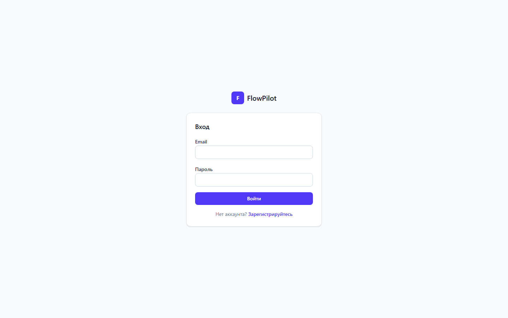
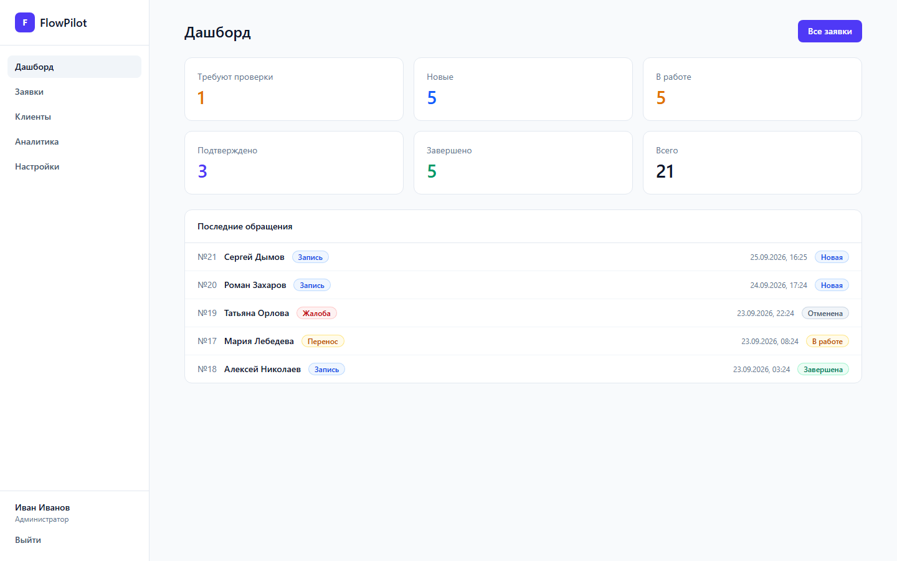
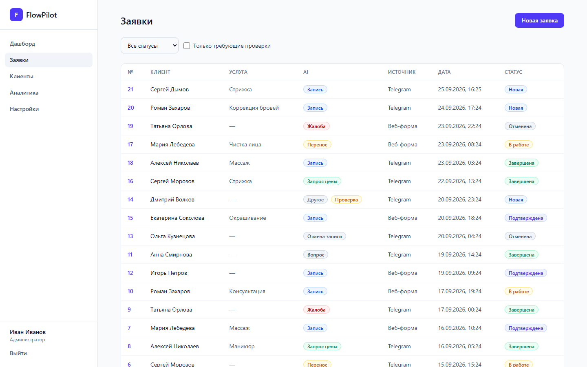
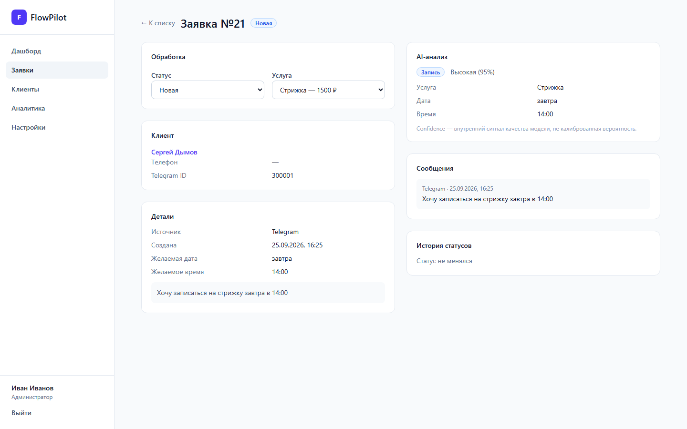
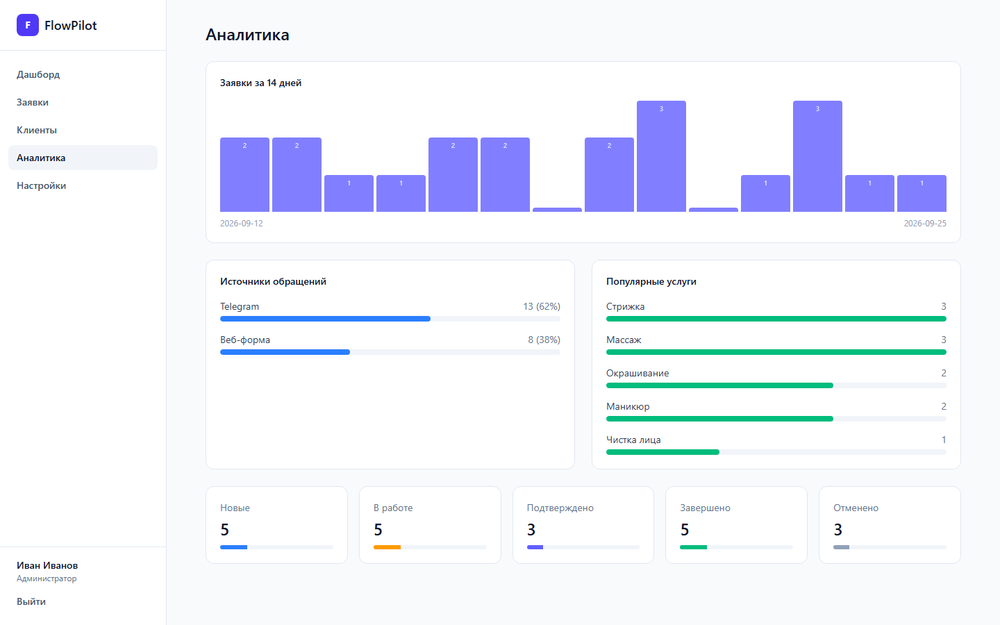
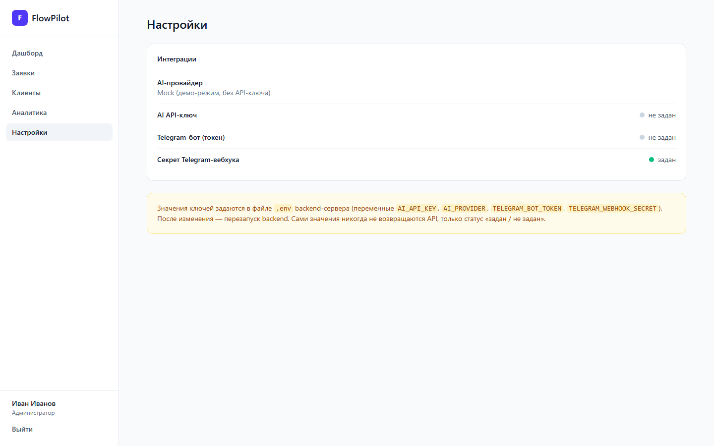

# FlowPilot

AI-ассистент обработки входящих обращений для малого бизнеса: сообщения
клиентов из Telegram или встроенной веб-формы классифицируются AI-слоем
(намерение, услуга, дата/время, уверенность), превращаются в заявки и
попадают к менеджерам в лёгкий CRM-дашборд.

**Проблема:** небольшой салон или студия получает записи, вопросы о
ценах, жалобы и просьбы о переносе вперемешку в одном чате. Прочитать,
разобрать, куда-то записать и не забыть — именно здесь теряются записи.

**Решение:** сообщение приходит на вебхук, проходит валидацию,
интерпретируется сменяемым AI-провайдером (по умолчанию Mock, OpenAI и
Qwen готовы к подключению) и становится заявкой с оценкой уверенности.
Высокая уверенность — заявка сразу в работе; низкая — помечена для
ручной проверки.

> Статус: **портфолио / демо-проект.** Полностью докеризован, покрыт
> тестами и security review, но **не задеплоен в продакшен** — см.
> [Known Limitations](#known-limitations).

```
Сообщение клиента → вебхук → валидация → AI-анализ → структурированный JSON
→ заявка в PostgreSQL → React-дашборд → работа менеджера
```

## Возможности

- JWT-аутентификация с ролями (`admin` / `manager`), проверка на
  backend (сокрытие в UI — удобство, а не защита).
- Конвейер заявок: `NEW → IN_PROGRESS → CONFIRMED → COMPLETED` /
  `CANCELLED` с полной историей статусов.
- Извлечение намерения с триажем по уверенности: ≥0.85 — авто,
  0.60–0.85 — проверка менеджером, <0.60 — только ручная обработка.
- Сменяемый AI-провайдер за одним интерфейсом: **Mock** (по умолчанию,
  без API-ключа, keyword-matching на русском/английском), OpenAI, Qwen
  — с парсингом JSON, одним ретраем и безопасным fallback при ошибках
  провайдера.
- Telegram-вебхук: проверка секрета, идемпотентность (повторные update
  не создают дубликатов заявок).
- Каталог клиентов с поиском и историей обращений по каждому.
- Дашборд и аналитика: счётчики статусов, тренд за 14 дней, источники,
  топ услуг, последние заявки.
- Двухслойный rate limiting: nginx `limit_req` + in-memory лимитер
  FastAPI (429 с `Retry-After`).
- Docker-стек одной командой: PostgreSQL, backend, frontend, nginx.
- Миграции Alembic применяются автоматически при старте контейнера;
  идемпотентный демо-сид (только при `AI_MODE=mock`).
- React-фронтенд (русский интерфейс): 9 страниц, состояния
  загрузки/ошибки/пустые данные, скелетоны, тосты; типы API
  генерируются из живой OpenAPI-схемы.

## Архитектура

```
Telegram / веб-форма
        ↓
POST /api/webhooks/telegram        POST /api/requests
        ↓ проверка секрета                ↓ JWT
      Nginx  — статика, reverse proxy, rate limiting (TLS в продакшене)
        ↓
      FastAPI  — маршрутизация, валидация, авторизация, rate limiting
        ↓
   Слой сервисов  — RequestService, TelegramService, ClientService,
                    AIAnalysisService, AnalyticsService
        ↓                          ↓
  AIProvider (Mock/OpenAI/Qwen)   Репозитории
        ↓ AIResult (Pydantic)            ↓
        └──────────────►  PostgreSQL  ◄──┘
                            ↓
                        REST API
                            ↓
                  React-дашборд
```

AI-конвейер (AI-слой никогда не пишет в базу — он предлагает,
сервисы решают):

```
Сообщение → AIProvider.analyze(text) → сырой ответ
        → парсинг JSON + Pydantic-валидация → AIResult
        → проверка confidence → авто / на проверку / ручная
        → RequestService записывает Request + Message + AIAnalysis
```

## Технологии

| Область | Технологии |
|---|---|
| Фронтенд | React 19, TypeScript, Vite, Tailwind CSS, TanStack Query, React Hook Form, Zod, openapi-typescript |
| Backend | Python, FastAPI, Pydantic, SQLAlchemy, Alembic, PyJWT, bcrypt, httpx |
| База данных | PostgreSQL 16 (SQLite in-memory в тестах) |
| Инфраструктура | Docker, Docker Compose, nginx, multi-stage сборки |
| Безопасность | JWT HS256, bcrypt, RBAC, двухслойный rate limiting, секреты только в env |
| Тестирование | pytest (67 тестов), FastAPI TestClient |

## Безопасность

- хеширование паролей bcrypt; пароли усекаются до 72-байтового лимита bcrypt
- JWT HS256 с запиненным алгоритмом и expiry
- проверка ролей на backend для admin-эндпоинтов
- `password_hash` никогда не возвращается API
- секрет вебхука сверяется через `hmac.compare_digest`
- rate limiting FastAPI (429) на login/register/webhook + nginx `limit_req`
- ограничения длины на каждое пользовательское поле
- только параметризованные ORM-запросы (без raw SQL)
- backend работает не из-под root; PostgreSQL без опубликованных портов;
  backend доступен только через nginx
- секретов нет в истории git, образах и фронтенд-бандле (проверено аудитом)
- sanitized-ответы об ошибках (без traceback, путей и внутренних деталей)
- изоляция данных по бизнесам; идемпотентность вебхука

Подробности и ограничения: [docs/SECURITY.md](docs/SECURITY.md) (англ.).

## Docker / развёртывание

### Локально / демо

```bash
cp .env.example .env      # задать POSTGRES_PASSWORD и JWT_SECRET
docker compose up --build -d
curl http://localhost/api/health
```

Стек: PostgreSQL (health-check) → backend (миграции + опциональный
демо-сид + uvicorn) → init-контейнер фронтенда (копирует `dist/` в
общий volume) → nginx. Демо-вход (только при `AI_MODE=mock` на пустой
базе — публичен by design): `admin@luna.ru / admin12345` (админ),
`maria@luna.ru / manager12345` (менеджер).

Прогон тестов внутри контейнера backend (Python 3.12):

```bash
docker run --rm -v "$(pwd)/backend/tests:/app/tests" \
  --entrypoint pytest flowpilot-backend -q
```

### Продакшен

Полная инструкция для VPS готова — Ubuntu, UFW, HTTPS через
Let's Encrypt (certbot), cron-обновление сертификатов, бэкапы
`pg_dump`, процедура обновления: [docs/DEPLOYMENT.md](docs/DEPLOYMENT.md)
(англ.).

HTTPS-путь (сертификаты + `docker-compose.override.yml` + `ssl.conf`
на домен, включая маппинг секретного заголовка Telegram) прорепетирован
локально с self-signed сертификатом и проверен на живом стеке.
**Реальный деплой на VPS в рамках проекта не выполнялся.**

## Тестирование

**67/67 пройдено** — локально (Python 3.14) и внутри Docker-образа
(Python 3.12). Покрытие: аутентификация (регистрация/логин/неверные
креды/защищённые эндпоинты), заявки (создание, фильтры, смена
статусов, права, изоляция бизнесов), AI (классификация Mock, fallback
на невалидном JSON, ретрай, неизвестные интенты), Telegram-вебхук
(валидный/отсутствующий/неверный секрет, дубликаты update), безопасность
(подмена и истечение JWT, утечка паролей, rate limits, границы входных
данных, отсутствие утечек в ошибках). CI-пайплайна нет — тесты
запускаются вручную.

## Скриншоты

| Вход | Дашборд |
|---|---|
|  |  |

| Заявки | Карточка заявки (AI-анализ, статусы) |
|---|---|
|  |  |

| Аналитика | Настройки (админ) |
|---|---|
|  |  |

Все скриншоты: [docs/screenshots/](docs/screenshots/).

## Структура проекта

```
flowpilot/
├── backend/
│   ├── app/
│   │   ├── api/            # роуты, зависимости
│   │   ├── core/           # конфигурация, безопасность, rate limiting
│   │   ├── models/         # SQLAlchemy-модели
│   │   ├── schemas/        # Pydantic-схемы
│   │   ├── services/       # бизнес-логика
│   │   ├── repositories/   # доступ к БД
│   │   ├── db/             # engine, session, base
│   │   ├── scripts/        # демо-сид
│   │   └── main.py
│   ├── alembic/            # миграции
│   ├── tests/              # 67 тестов
│   ├── Dockerfile
│   └── entrypoint.sh       # миграции + сид + uvicorn
├── frontend/               # React + TypeScript + Vite + Tailwind
│   └── src/{pages, components, contexts, services, types}
├── nginx/                  # конфигурация reverse proxy
├── docs/                   # SECURITY.md, DEPLOYMENT.md, скриншоты
└── docker-compose.yml
```

## Что я узнал

**«Работает локально» ≠ «работает в целевом runtime».** Весь backend
проходил 51 тест на моей машине (Python 3.14) и падал при импорте в
Docker-образе (Python 3.12). Причина: метод репозитория с именем `list`
затенял builtin `list` внутри тела класса, и аннотация `list[Request]`
следующего метода резолвилась в *метод*, а не builtin. Python 3.14 это
прячет (PEP 649 сделал аннотации ленивыми), 3.12 вычисляет их
eagerly. Фикс — одна строка на файл: `from __future__ import
annotations`. Урок: тестируй в том же runtime, в котором шипишь, —
зелёный локальный прогон ничего не говорит о контейнере.

**Мёртвые библиотеки кусаются позже.** `passlib` (последний релиз —
2020) сломался с современным `bcrypt` на Python 3.14 — падал уже на
тестовом хеше. Отказ от обёртки в пользу прямого `bcrypt` убрал мёртвую
зависимость и сделал причину отказа очевидной.

**SQLite прощает, PostgreSQL — нет.** Два бага схемы пережили все
прогоны на SQLite и взорвались на PostgreSQL: `alembic --autogenerate`
продублировал CHECK-констрейнты (одно имя дважды в таблице), а таблица
истории с двумя enum-колонками делила одно имя констрейнта. SQLite
молча принимал оба. Урок: прогоняй миграции на настоящей БД, прежде
чем считать схему готовой.

## Инженерные решения

- **Docker Compose** — вся среда (БД, backend, фронтенд, nginx) в одном
  файле; ревьюер воспроизводит стек одной командой.
- **PostgreSQL в продакшене, SQLite в тестах** — тесты остаются
  быстрыми; реальный движок всё же проверяется прогоном внутри
  контейнера и compose-стеком.
- **nginx — единственная точка входа** — статика без Python, rate
  limiting до приложения, TLS терминируется на уровне инфраструктуры.
- **Backend не из-под root** — дешёвый харденинг, стандартная практика.
- **Два слоя rate limiting** — nginx останавливает флуд, даже если
  приложение деградировало; FastAPI лимитирует точно по роуту и работает
  без nginx (локальная разработка). Defense in depth.
- **In-memory rate limiter** — честный trade-off: корректен для одного
  процесса, что и есть масштаб этого проекта. Горизонтальное
  масштабирование потребует Redis; добавлять его сейчас —
  спекулятивная инфраструктура.
- **JWT в localStorage** — проще, чем httpOnly-куки + CSRF-защита, с
  задокументированным XSS-риском. Приемлемо на этом этапе, пересмотреть
  для реального продакшена.
- **HTTPS в слое деплоя** — приложение не знает про TLS; сертификаты и
  обновления принадлежат инфраструктуре (см. DEPLOYMENT.md), что
  держит контейнер простым и одинаковым в dev и prod.

## Известные ограничения

- In-memory rate limiting покрывает один процесс (для масштабирования
  нужен Redis).
- JWT в `localStorage` — при успешном XSS токен будет скомпрометирован.
- HTTPS требует продакшен-деплоя (прорепетирован локально, на VPS не
  выполнялся).
- Деплой на продакшен-VPS **не** выполнялся — только документация.
- Интеграция с Telegram не проверена end-to-end с реальным ботом
  (проверены эндпоинт и маппинг секретного заголовка).
- `AI_MODE=mock` — демо-режим по умолчанию: MockProvider делает
  keyword-matching, а не настоящий NLP.
- Демо-кредиты публичны by design; сид запускается только при
  `AI_MODE=mock` на пустой базе.
- CI-пайплайна нет — тесты запускаются вручную.

## Документация

- [docs/SECURITY.md](docs/SECURITY.md) — security review: что
  проверено, что исправлено, что остаётся ограничением (англ.).
- [docs/DEPLOYMENT.md](docs/DEPLOYMENT.md) — инструкция деплоя на VPS
  (Ubuntu, Docker, Let's Encrypt, бэкапы, обновления) (англ.).
- [docs/CASE_STUDY.md](docs/CASE_STUDY.md) — case study для портфолио
  (англ.).
- [AGENTS.md](AGENTS.md) — исходный план проекта и архитектурные
  правила, которым он следует.
